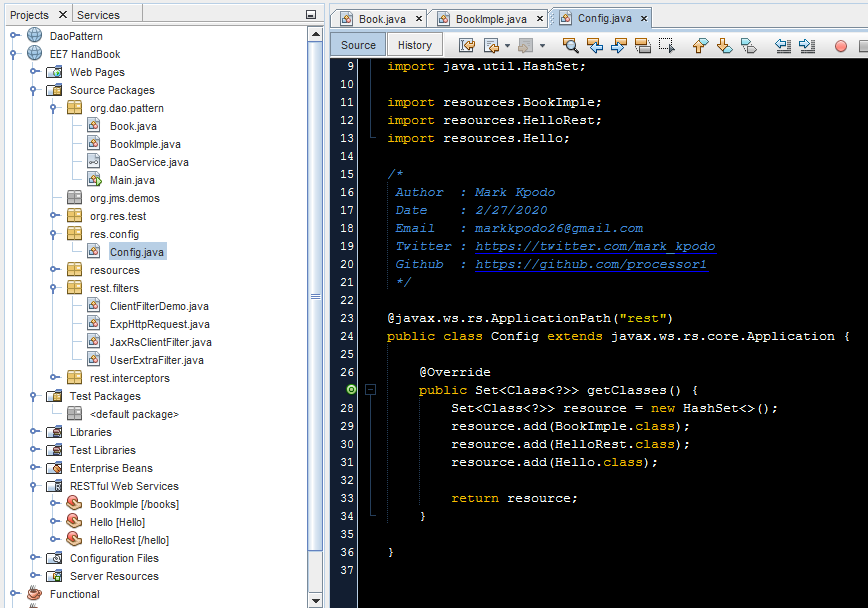
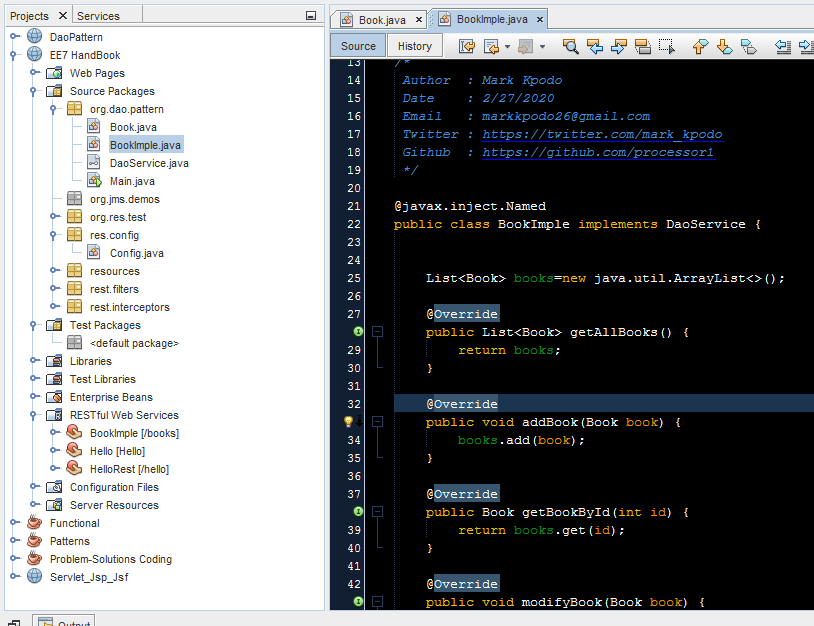

# Java-EE-7-Handbook-Practice
Jakarta EE working with Jax-rs ,CDI,Servlet. Jakarta EE  make's rest development fun and when it comes to micro-services.
Using Jakarta EE  i installed glassfish application server version 5  and added some  annotations to bean.
This is very simple examples of Jakarta EE dao,jms,rest,cdi examples.

This is screenshot of rest configuration class ,using Jakarta EE you can config your rest by xml or by Java class by just annotating the class,
@ApplicationPath("rest_endpoint") ,you can leave this class empty.

The screenshot of pojo class .

